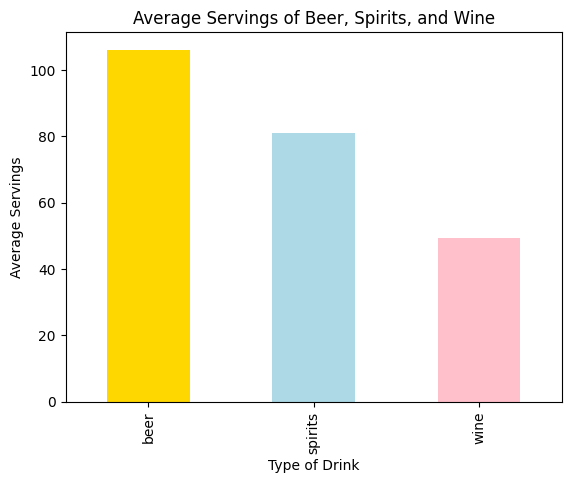

# Alcohol Consumption Data Analysis Summary

## Basic Statistics
|       |    beer |   spirits |     wine |   total_alcohol |
|:------|--------:|----------:|---------:|----------------:|
| count | 193     |  193      | 193      |        193      |
| mean  | 106.161 |   80.9948 |  49.4508 |          4.7171 |
| std   | 101.143 |   88.2843 |  79.6976 |          3.7733 |
| min   |   0     |    0      |   0      |          0      |
| 25%   |  20     |    4      |   1      |          1.3    |
| 50%   |  76     |   56      |   8      |          4.2    |
| 75%   | 188     |  128      |  59      |          7.2    |
| max   | 376     |  438      | 370      |         14.4    |

## Top 5 Countries by Total Alcohol Consumption
|    | country        |   total_alcohol |
|---:|:---------------|----------------:|
| 15 | Belarus        |            14.4 |
| 98 | Lithuania      |            12.9 |
|  3 | Andorra        |            12.4 |
| 68 | Grenada        |            11.9 |
| 45 | Czech Republic |            11.8 |

## Correlation Matrix
|               |     beer |   spirits |     wine |   total_alcohol |
|:--------------|---------:|----------:|---------:|----------------:|
| beer          | 1        |  0.458819 | 0.527172 |        0.835839 |
| spirits       | 0.458819 |  1        | 0.194797 |        0.654968 |
| wine          | 0.527172 |  0.194797 | 1        |        0.667598 |
| total_alcohol | 0.835839 |  0.654968 | 0.667598 |        1        |

## Visualizations
### Average Servings by Drink Type

### Top 5 Countries by Total Alcohol Consumption

### Distribution of Servings

### Alcohol Consumption by Category

